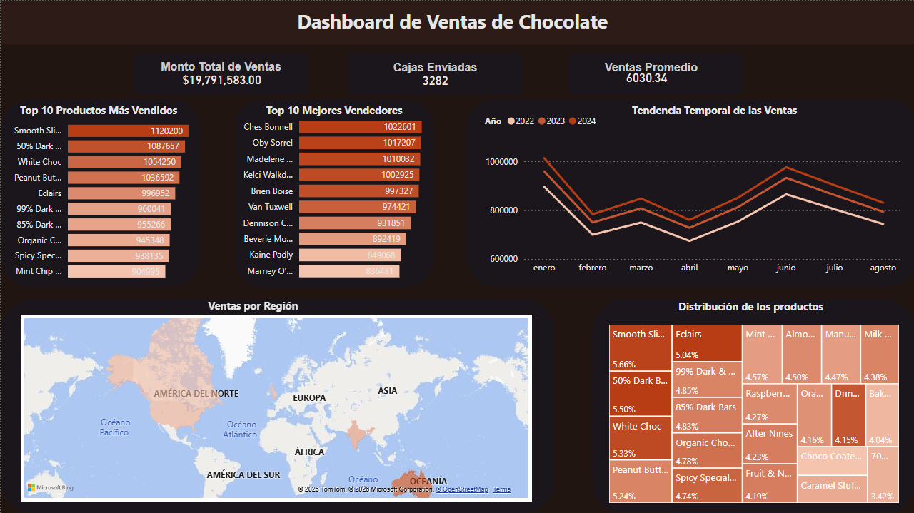

# 📊 Chocolate
# Analisis sobre la venta del Chcocolate

Este proyecto realiza un análisis sobre las ventas del chocolate a nivel global. El conjunto de datos incluye información sobre registros transaccionales detallados de las ventas globales de productos de chocolate desde enero de 2022 hasta agosto de 2024.

---

## 📚 Tabla de Contenidos

- [🎯 Propósito](#-propósito)
- [📦 Conjunto de Datos](#-conjunto-de-datos)
- [🧪 Desarrollo del Proyecto](#-desarrollo-del-proyecto)
- [📌 Vista previa del dashboard](#-vista-previa-del-dashboard)
- [💡 Insights claves](#-insights-claves)
- [🛠️ Tecnologías](#️-tecnologías)
- [👤 Autor](#-autor)

---

## 🎯 Propósito

El objetivo de este proyecto es determinar las ventas globales del chocolate, con el fin de responder a las siguientes preguntas:
* ¿Cómo están las ventas?
* ¿Estamos creciendo?
* ¿Qué productos impulsan el negocio?
* ¿Dónde hay oportunidad?

Obtener métricas bases:
* KPI General
   - Ventas totales
   - Total transacciones
   - Ticket promedio

* Ventas por mes
   - Año
   - Mes
   - Crecimiento MoM

* Top productos
   - Ventas por producto

* Ventas por región
   - Region con la mayor ventas
   - Region con la menor ventas
   - Producto más vendido por región
   - Producto menos vendido por región

---

## 📦 Conjunto de Datos

El conjunto de datos utilizado contiene las siguientes columnas:

- `Sales Person`: El nombre del vendedor responsable de la venta.
- `Country`: El país donde se realizo la venta.
- `Product`: El nombre y tipo del producto vendido.
- `Date`: Fecha en que se produjo la transacción de ventas(formato DD/MM/AAAA).
- `Amount`: El monto total de ventas de la transacción, expresado en dólares estadounidenses.
- `Boxes Shipped`: El número de cajas de productos enviadas como parte de la transacción.

Fuente: [Chocolate Sales](https://www.kaggle.com/datasets/saidaminsaidaxmadov/chocolate-sales).

---

## 🧪 Desarrollo del Proyecto

### **Exploración inicial de los datos - Limpieza y preprocesamiento**
Se identificaron inconsistencias en los campos Date y Amount.
Se realizó normalización de formatos, conversión de tipos y validación de calidad de datos (nulos y duplicados).

### **Análisis exploratorio de datos (EDA)**
* El negocio muestra desaceleración reciente pese al crecimiento histórico.
* El portafolio presenta baja dependencia de productos individuales.
* Existen diferencias regionales que sugieren oportunidades de optimización del catálogo.
* Se detectaron vacíos de datos que afectan la lectura del desempeño real.

---

## 📌 Vista previa del dashboard

---

## 💡 Recomendaciones

### Optimización del portafolio por región
Acción:
* Priorizar inventario y visibilidad de SKUs top por región.
* Reducir distribución de SKUs con bajo desempeño local.
* Ajustar promociones según preferencias regionales.

Impacto esperado:
* Mejor rotación.
* Menor costo logístico.
* Incremento de conversión.

### 2.-Racionalización de SKUs de baja rotación

Problema detectado:
Bottom performers regionales podrían generar costos ocultos.

Acción:
* Identificar SKUs consistentemente en bottom 10% por región.
* Evaluar descontinuación parcial o sustitución.
* Reasignar presupuesto a productos líderes.

Impacto esperado:
* Reducción de inventario muerto.
* Mejora margen.
* Simplificación operativa.

---

## 🛠️ Tecnologías

- MySQL Workbench 8.0 CE
- Power BI

---

## 👤 Autor

**Said Mariano Sánchez** – *smariano170@gmail.com*  
Este proyecto forma parte de mi portafolio como analista de datos Jr.

---

## 📝 Licencia

Este proyecto está licenciado bajo la **Licencia MIT**. Puedes usarlo, modificarlo y distribuirlo libremente, siempre que menciones al autor original.

---